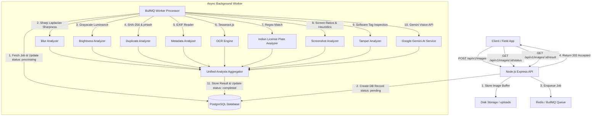
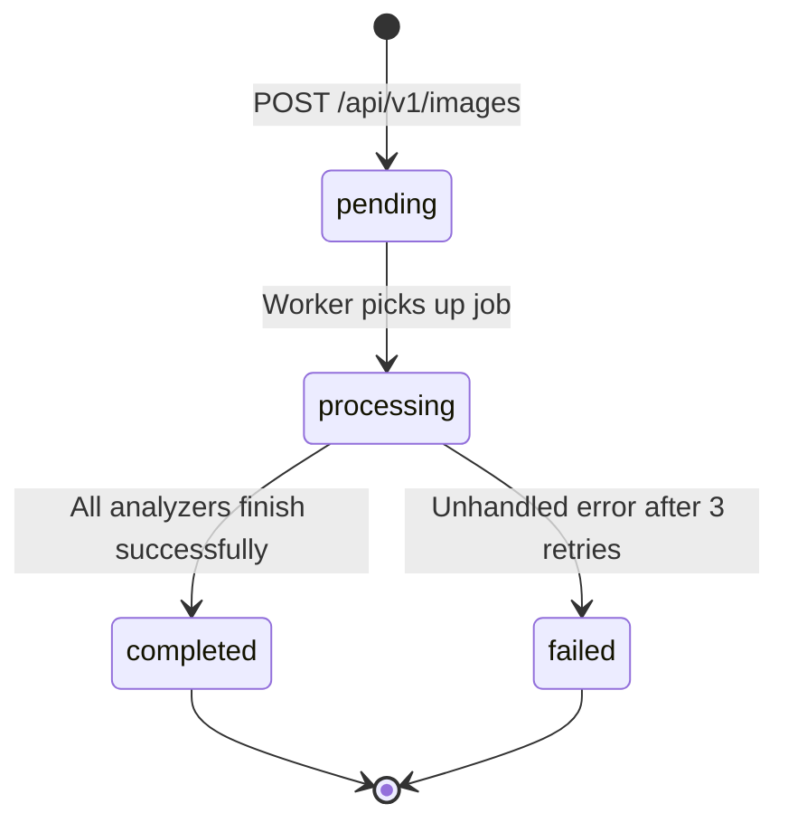

# System Architecture & Technical Specifications

## Intelligent Media Processing Pipeline

The Intelligent Media Processing Pipeline is an asynchronous, event-driven micro-architecture designed for auto-rickshaw and vehicle verification. It processes incoming vehicle image uploads, performs 8 deterministic image quality & authenticity checks, integrates optional AI Vision, and persists structured analysis reports.

---

## 1. High-Level Architecture Diagram

---

## 2. Component Specifications

### 2.1 API Ingestion Layer (`src/app.js`, `src/controllers/image.controller.js`)
- **Non-blocking Upload**: Accepts `multipart/form-data` image payloads.
- **Validation**: Enforces MIME type checks (`image/jpeg`, `image/png`, `image/webp`) and size limit (10 MB default).
- **Immediate Response**: Generates a UUID `processingId`, stores the file on disk, creates a database record with `status = 'pending'`, enqueues the job into BullMQ, and immediately responds with **HTTP 202 Accepted**.

### 2.2 Queue & Worker Architecture (`src/queues/image.queue.js`, `src/processors/image.processor.js`)
- **Queue Engine**: BullMQ backed by Redis (`ioredis`).
- **Deduplication & Concurrency**: Jobs use `processingId` as `jobId` to avoid duplicate processing. Concurrency is configured to process up to 5 concurrent images per worker thread.
- **Resilience**: Configured with exponential backoff retries (3 attempts, 2000ms base delay). Failed jobs trigger `imageService.markProcessingFailed(...)` without unhandled exceptions or worker crashes.

### 2.3 Image Quality & Authenticity Analyzers (`src/analyzers/`)
1. **Blur Detection (`blur.analyzer.js`)**: Computes Laplacian variance across normalized raw grayscale pixel buffers. Values below threshold (40) flag blurry images.
2. **Brightness & Lighting (`brightness.analyzer.js`)**: Evaluates mean luminance (0-255) and pixel distribution. Flags underexposed (`< 45`) and overexposed (`> 215`) lighting conditions.
3. **Duplicate Detection (`duplicate.analyzer.js`)**: Generates exact SHA-256 hashes and 16-bit perceptual hashes (`image-hash`). Checks DB for exact hash duplicates or visual similarity (Hamming distance `<= 8`).
4. **EXIF Metadata (`metadata.analyzer.js`)**: Extracts camera manufacturer, model, software tag, creation date, and GPS coordinates using `exif-reader` and Sharp.
5. **OCR Engine (`ocr.analyzer.js`)**: Uses `tesseract.js` to extract text strings from vehicle registration marks.
6. **Indian License Plate Validation (`plate.analyzer.js`)**: Applies regex rules (`/[A-Z]{2}[0-9]{1,2}[A-Z]{1,3}[0-9]{4}/`) and state code verification across OCR text.
7. **Screenshot Detection (`screenshot.analyzer.js`)**: Inspects aspect ratio matches (19.5:9, 20:9, 16:9), filename keywords (`screenshot`), PNG format without camera EXIF headers.
8. **Tamper & Editing Detection (`tamper.analyzer.js`)**: Flags software tags specifying graphics software (Photoshop, Canva, GIMP, Lightroom, Snapseed).

### 2.4 Optional AI Vision Integration (`src/services/ai.service.js`)
- Uses **Google Gemini Vision API** (`gemini-1.5-flash`).
- Returns structured categorization (Vehicle Type, Make/Model candidate, plate legibility, overall vehicle condition).
- Features **graceful fallback**: If `GEMINI_API_KEY` is missing or fails, the pipeline safely completes using deterministic checks without failing.

---

## 3. Database Schema & State Transitions

### PostgreSQL Model (`Image`)
- `id` (UUID, Primary Key)
- `originalName` (String), `filePath` (String), `mimeType` (String), `size` (Int)
- `hash` (String, Indexed SHA-256), `perceptualHash` (String)
- `status` (String: `pending`, `processing`, `completed`, `failed`)
- `failureReason` (String), `failureCategory` (String), `retryCount` (Int)
- `processingStartedAt` (Timestamp), `processingCompletedAt` (Timestamp)
- `result` (JSONB unified output)
